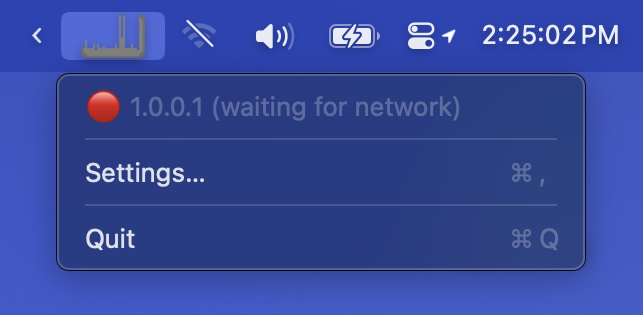

# PingThing

A lightweight menubar app that displays a scrolling graph in your menubar of ICMP latency to a specified target.

Inspired by [Pingr](https://getpingr.app/), which appears to have been abandoned in 2021.

# Settings

Most settings should be self-explanatory. Here is an image of the Settings dialog:

You can choose a ping interval between 0.1 and 60 seconds.

**History size** controls how many response times are stored and displayed in the menubar graph. If you hover your mouse over the graph, a tooltip will show the current and average RTT times:

The graph will dim/turn gray if network connectivity is interrupted:

# Bugs? 🐛

There might be bugs! Also, I didn't write the ICMP code—I'm using the [SwiftyPing](https://github.com/samiyr/SwiftyPing) library. Please report [issues](https://github.com/luckman212/pingthing/issues) and I will do my best to address them.
